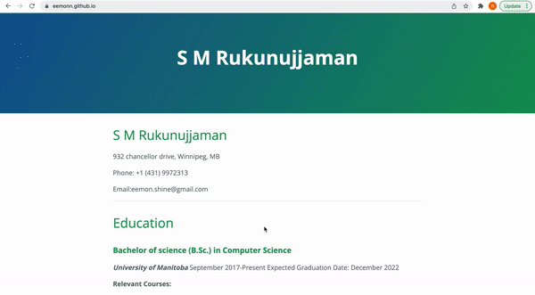

#  How to host a resume on Github pages

## **Purpose**
The purpose of this readme is how to write a resume in Markdown and host it online in Github using Jekyll and Github pages. All of these is related to the general principles of current technical writing as explained in the `Andrew Etter's` book 
    [Modern Technical Writing](https://www.amazon.ca/dp/B01A2QL9SS?ie=UTF8&*entries*=0&viewID=&*Version*=1).

## **Prerequisites**

- Prerequiaites are :
    -  Best markdown editors are listed here in [More Resorces](https://github.com/eemonn/eemonn.github.io/blob/main/README.md#more-resources)
    
    - For formatting a resume in markdown go to the markdown tutorial here in [More Resorces](https://github.com/eemonn/eemonn.github.io/blob/main/README.md#more-resources)
    
    - you can have a look a sample resume here in [Sample resume](https://github.com/eemonn/eemonn.github.io/blob/main/index.md)
    
    - A tutorial on how to get started with github is here [More Resorces](https://github.com/eemonn/eemonn.github.io/blob/main/README.md#more-resources)

## **Instructions**

## 1. Choosing a Lightweight Markup Language and Editor

First step is to create a resume using a Lightweight Markup Language.
In the book `Modern Technical Writing`, Andrew Etter recommends to use Markdown to do this . Because compared to other markup languages, Markdown is very simple, human-readable, and easy to learn. In addition, Markdown  files are plain text so they can be edited by any editor. Andrew Etter indicated that for all of these handy features Mardown is the most widely used lightweight markup language across the world. 

To start, we will first need to choose a Markdown editor. For this purpose i am using [Xcode](https://developer.apple.com/xcode/) for my mac. Just for information, `Xcode` is more easy to use when you are a mac user. A list of popular markdown editors is presented in `More Resources`

In book,`Modern technical Writing` , Andrew Etter suggested some markdown editors which are following:

- [MardownPad](http://www.markdownpad.com) (Windows)
- [iAWriter](https://ia.net/writer) (macOS)
- [ReText](https://sourceforge.net/directory/development/wordprocessors/os:windows/) (Linux)

## 2. Resume formatting in Mardown

Use a editor that you like to format the resume in markdown. For any help that you seek with this, you can go to `getting started with Markdown` that is included in `More Resources`.

Markdown is available in several variants/flavours and for the purpose of this task, we will use a [GitHub Flavoured Markdown](https://github.github.com/gfm/) 
to ensure that is gets properly rendered in Github Pages. 

At last, ensure that your resume is named as `index.md`, which is necessary for parsing the file internally for Github.

## 3. Use a Distributed Version Control System

Now upload the markdown formatted resume to a distributed version control system (DVCS) such as Git.
    Etter highly recommends using DVCS over centralized systems. DVCS is better in performanc, allow for offline work, and are superior for concurrent work on the same file. Etter quotes, "For technical writers, the most important reason to use DVCS is that develops prefer them."
 
 For our task, we will use [Github](https://github.com/). It is a ditributed version control system and open-source. It allows many people to work on a project seamlessly without hampering the integrity of original project. It offers the distributed version control and source code management functionality of Git, plus its own features.
 
 
 ## 4. Create a Github account
 
 At first, we need a Github account for that. If you previously have an account on Github you can use that account. If you do not have any account on github need to create an account. This is very simple. The steps are below:
 
 
 - Create an account
    1. go to [Github](https://github.com).
    2. on the top right side click `Sign up` 
    3. Then fill up the following informations and press `continue`.
    4. do this until you finished up creating an account.
    

## 5. Create a Github Repository 

Now, we have github account. We need to upload the resume on Github. For this, We need to set up a github repository and then push our resume to it. The steps are below:

- Create a repository
    1. Log in to your GitHub account.
    2. On the [homepage](https://github.com/), click the green `New` button  on the `Repositories` section.
        Name your repository `<YourUsername>.github.io` where `<YourUsername>` is your GitHub `username`. 
    4. make sure that the repository is `public` and click the `Create Repository` button to create the repository. 
  
  
  ## 6. Adding resume to the respsitory
  
  once repository is created it's time to add resume to respository. For uploading/adding resume follow the below steps:
  
  - Add resume to the respository
    1. Once the new repository has been created,and there is no file in the repository then
     on the `Quick Setup` panel, click on the `uploading an existing file` button.
    2. If your repository already contains files, click the `Add file` button and choose `Upload files`
    3. Before uploading resume, rename your  file to `index.md` . After renaming upload it to the respository and click the green `Commit changes` button. Your file should now have been added to your repository.
    
   Adding resume to respository can also be done using commandline. In this case, you need to use some version control tool such as git. You can find help from [here](https://guides.github.com/activities/hello-world/).
   
   ## 7. Generate a static website
   
   The final step to this task is to use a static website to host the resume that we created. In his book, Etter deeply encourages making static websites due to their speed, simplicity, portability, and security. Additionally, Etter mentions that they have no server-side application dependencies, no databases, and nothing to install and are therefore always an excellent option to consider.  

    For hosting our resume we will use [Github pages](https://pages.github.com/) and [jekyll Theme](https://jekyllrb.com/docs/themes/#pick-up-a-theme). These tools are totally free and generate a static website form a markdown file. In this case, generate a static website for our resume.
    
    
    ## 8. Host resume on Github Pages
    
    We can use jekyll themes from Github pages to host our resume in Github. For that follow the below steps :
    
    1. Go to your `<username>.github.io`  respository and click `Settings`.
    2. On the left side under the `General` bar you will find `Pages` section, click on it.
    3. Make sure that the `main branch` is selected under the `Source` section.
    4. Now, click on the `change theme` button . It will show you some theme that you can use. Some theme are pre-installed in Github and some are not. For not installed theme, just install theme by clicking one of `.zip` or `.tar`. Then you can able to use the theme.
    5. Choose a theme and click on `Select Theme`. Now this theme is set and brings you back to the settings window.
    6. now go back to your respository and you will see a file name `_config.yml`. On that row you will see `set Theme to jekyll-x`, `x` is a theme name here. Click on that you will see a box below. Click on the box and add some comments there. now click `comments on this commit`.
    7. our static website is now ready to use. 
    
    The final Static site should look like this:
    
     
    

## **Authors and Acknowledgement**

This document is written by S M Rukunujjaman with the help of Andrew Etter's book `Modern Technical Writing`.

I would like to thank  my course instructor Stewart Wilcox for giving us instructions on how we should effectively do this in his course Technical Communication in Computer Science. Also would like to thank my group members with whom i dicussed how to make it better with proper writing.

## **FAQs**

### **Why is Markdown better than a word processor?**

Markdown is secure compared to word processor because markdown is more readable and has more structured output. Markdown is very easy to learn, Since it is a plaintext editor you can use any editor you want to edit it. The benefit it provides over a word processor is that due to Markdown's structure and syntax, it can easily be rendered and processed by computers and other programs. Also, mardown is fast, easy to format without having to take your hands off the keyboard.

### **Why is my resume not showing up?**

It sometimes take time to show the github pages .So if the resume does not show up right away, check back in after a few minutes. sometimes when you change the theme it does not applied right away, it may take several minutes for showing up. So, you can wait few minutes for the showing up the resume. If then also it's not showing properly just close the current github tab and reopen github in another tab. It will solve this prolem then. In addition to that do the following steps properly

- The repository is named `<YourUsername>.github.io` where `<YourUsername>` is your `GitHub username`
- mardown resume must be named `index.md` and your resume is published in github pages under `Settings`. 
    

## **More Resources**

1. [List of Best Markdown Editors](https://www.shopify.com/partners/blog/10-of-the-best-markdown-editors)
2. [Getting started with Markdown](https://www.markdownguide.org/getting-started/)
3. [Getting started with Git and Github](https://www.freecodecamp.org/news/git-and-github-for-beginners/)
4.  [Modern Technical Writing](https://www.amazon.ca/dp/B01A2QL9SS?ie=UTF8&*entries*=0&viewID=&*Version*=1) by Andrew Etter 
